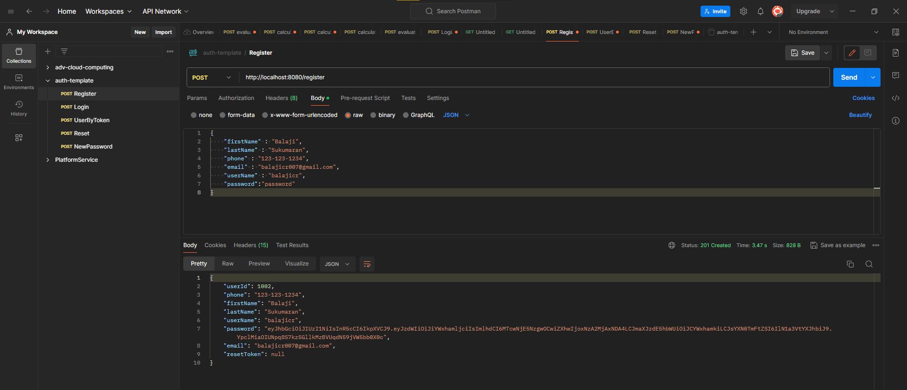
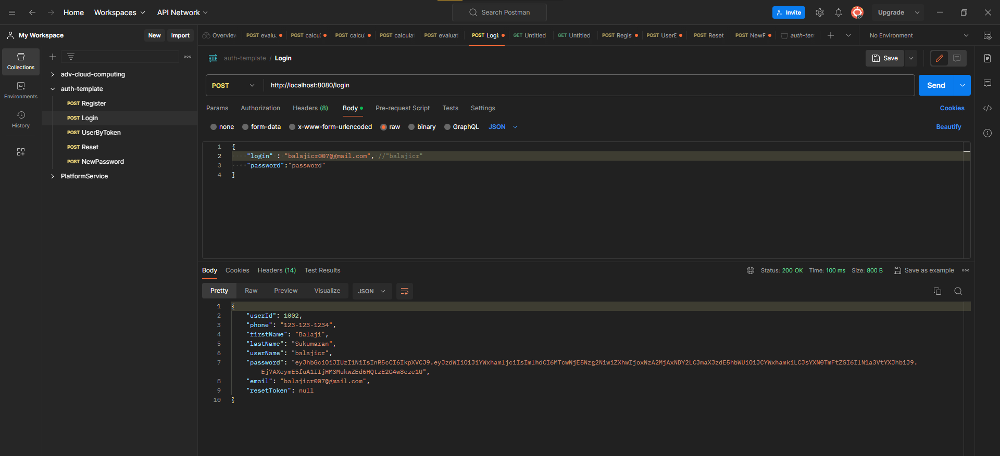
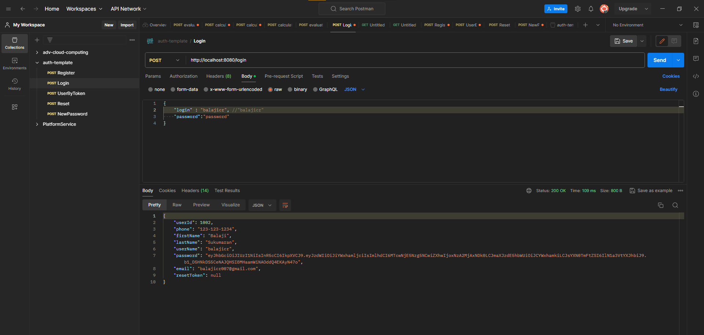
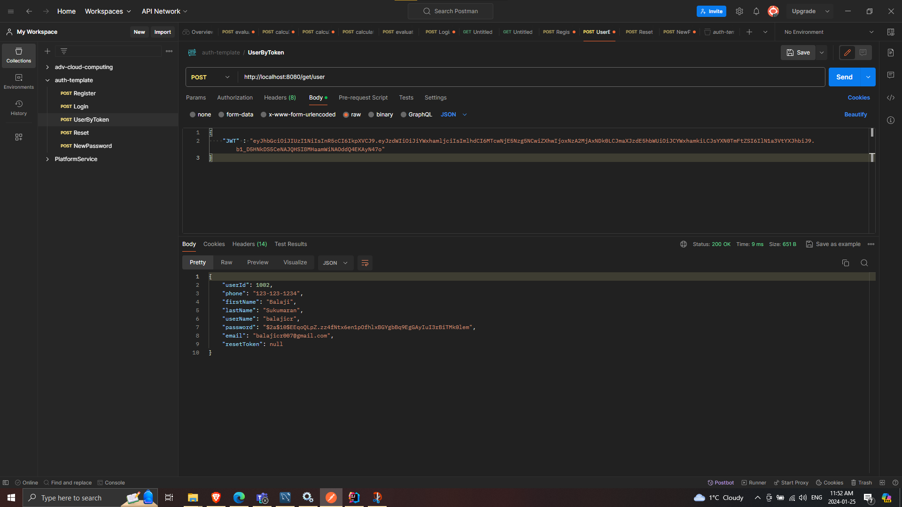
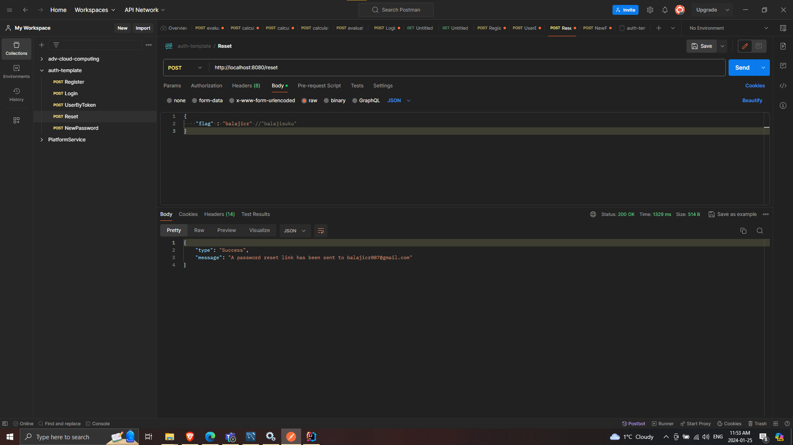
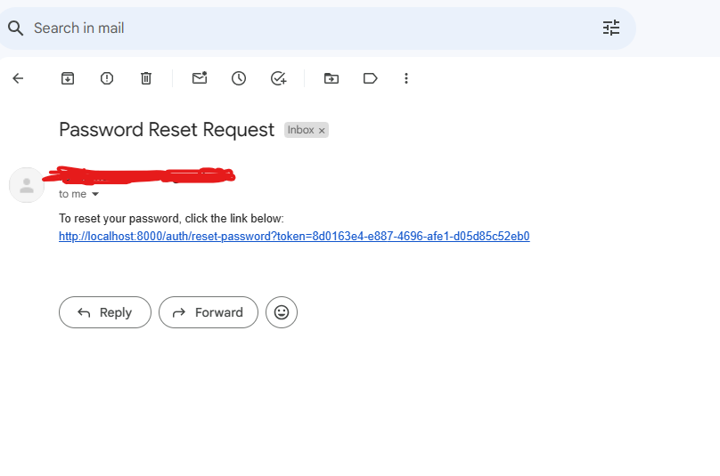
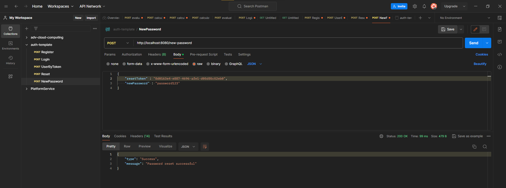

# JWT-Based Authentication Template

## Description
This repository contains a template for implementing JWT-based registration and login functionality in a Spring boot application. Additionally, it includes a reset password feature.

### Key Features
- JWT (JSON Web Token) based registration and login
- Password reset functionality

## Documentation
A sample Postman collection demonstrating how to use these features is available in the `/docs/auth-template.postman_collection.json` directory of this repository.

## Test Runs
To provide a clearer understanding of how the features work, screenshots of test runs are included:

- **Register**: 

  Register a new user. Email is mandatory for the reset password to work
  

- **Login**:
  
  1. Login by email.
     
     
  2. Login by username.
     

- **Get user by token**:
  User details can be fetched using the jwt token.
     

- **Reset**:

  1. Placing a password reset request, user can either use username or email,
     
     
  2. Email reset email received. Click this link to reset.
     
  
  3. Front end should pick the token from url pass it along with the new password.
    

## Setup and Installation

### Steps to Clone
1. Clone the repository directly and rename the `api` package to suit your project's naming conventions.
2. Execute the command to create the user table. A sample command is provided below. Feel free to add more columns as per your requirement, but ensure to update the user entity and DTO Java files accordingly.

### Reset Password Setup
3. To enable the reset password feature, create an email account for your application and enable SMTP through the mail server. For assistance, refer to this video on enabling SMTP in Gmail: [Enabling SMTP in Gmail](https://www.youtube.com/watch?v=D-NYmDWiFjU).
4. Update the `application.properties` file according to your project's requirements.

### Running the Application
5. Run the application after completing the above setup.

## Contributing
Feel free to fork this repository and contribute to its development. Your contributions towards improving the functionality and efficiency of this template are highly appreciated.
